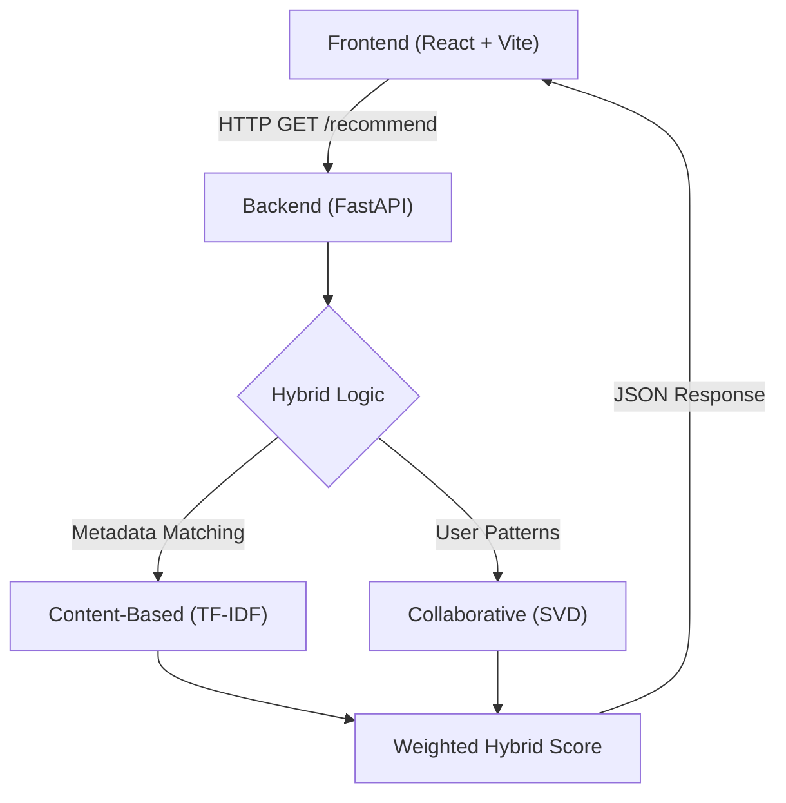

# 🎬 WatchWise — Hybrid Movie Recommendation System

**WatchWise** is a robust Hybrid Movie Recommendation System that delivers personalised movie suggestions by seamlessly combining **Content-Based Filtering** and **Collaborative Filtering (SVD)**. 

The system utilises real-world datasets (MovieLens & TMDB), a Python-based machine learning backend for inference, and a modern, responsive React frontend for visualisation.

---

## 🚀 Key Features

* **🎯 Hybrid Recommendation Engine:**
    * **Content-Based:** TF-IDF Vectorization & Cosine Similarity.
    * **Collaborative:** Matrix Factorisation using SVD (Singular Value Decomposition).
* **⚡ Real-Time Inference:** High-performance API built with **FastAPI**.
* **🎨 Modern UI:** A responsive interface crafted with **React, Vite, Tailwind CSS, and shadcn/ui**.
* **📊 Performance Metrics:** Evaluated using RMSE (Root Mean Squared Error).
* **🧪 Real-World Data:** Trained on the **MovieLens 100K** and **TMDB 5000** datasets.
* **🔗 Full Integration:** No mock data—all recommendations are computed dynamically.

---

## 🧠 System Architecture

The application follows a client-server architecture where the frontend communicates with the backend via RESTful API calls.

##🔧 Tech Stack
# Backend
ComponentTechnologyFrameworkPython, FastAPIData ProcessingPandas, NumPyMachine LearningScikit-learn, Surprise (SVD)ServerUvicornFrontendComponentTechnologyFrameworkReact (Vite)LanguageTypeScriptStylingTailwind CSS, shadcn/ui📁 Project StructureBashcinema-ai/
├── backend/                # Python ML backend
│   ├── api.py              # FastAPI entry point
│   ├── hybrid.py           # Recommendation logic class
│   ├── requirements.txt    # Python dependencies
│   ├── models/             # Serialised .pkl files (see README inside)
│   └── data/               # Dataset files (see README inside)
│
├── src/                    # React frontend source code
├── public/                 # Static frontend assets
├── index.html
├── package.json
└── README.md               # Main documentation
## ▶️ Getting Started
#1. Backend Setup (Python): 
Navigate to the backend directory and install the necessary dependencies.

cd backend
pip install -r requirements.txt

Run the FastAPI server:

uvicorn api:app --reload

The backend will start at: http://127.0.0.1:80002. 

## Frontend Setup (React)
Open a new terminal, navigate to the root (or src), and install dependencies.

npm install

Run the development server:

npm run dev

The frontend will start at: http://localhost:8080 (or the port specified by Vite).

##📡 API Reference
#Get Recommendations
Endpoint: GET /recommend
# Query Parameters:
user_id (int): The ID of the user (from MovieLens dataset).
movie (string): The title of the movie the user is currently viewing/interested in.

Example Request:

GET [http://127.0.0.1:8000/recommend?user_id=1&movie=Avatar](http://127.0.0.1:8000/recommend?user_id=1&movie=Avatar)

Example Response:
{
  "recommendations": [
    "Aliens",
    "Titanic",
    "The Abyss",
    "Prometheus",
    "Avatar: The Way of Water"
  ]
}

## 📊 Model Performance
We evaluate our model using RMSE (Root Mean Squared Error) to ensure recommendation accuracy.

RMSE~0.94

Indicates predicted ratings differ from actual user ratings by less than 1 star on average.

##📦 Datasets
This project is trained on the following open-source datasets:
1. MovieLens 100K Dataset: Used for Collaborative Filtering (User-Movie Matrix).
2. TMDB 5000 Movies Dataset: Used for Content-Based Filtering (Metadata, Genres, Cast).

**Note on Large Files:** Due to GitHub file size limitations, the trained .pkl model files and large CSV datasets are not tracked in this repository. Please refer to backend/models/README.md for instructions on how to regenerate the models locally using the provided source code.

## 🎓 Academic Notes
This project serves as a practical demonstration of:
1. Hybrid Systems: Overcoming the "Cold Start" problem by combining two filtering methods.
2. System Design: Decoupling ML computation (Backend) from User Interface (Frontend).
3. Deployment Readiness: Using production-ready frameworks (FastAPI) rather than notebook scripts.
